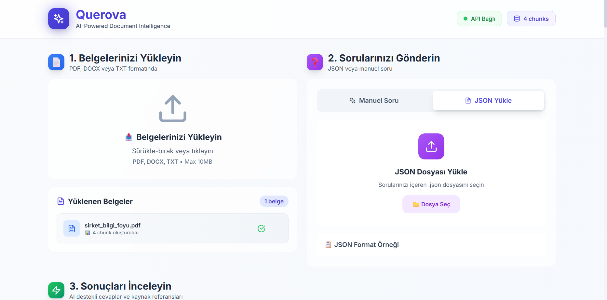
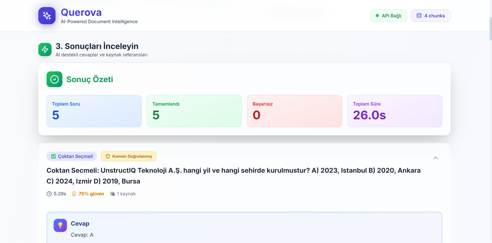
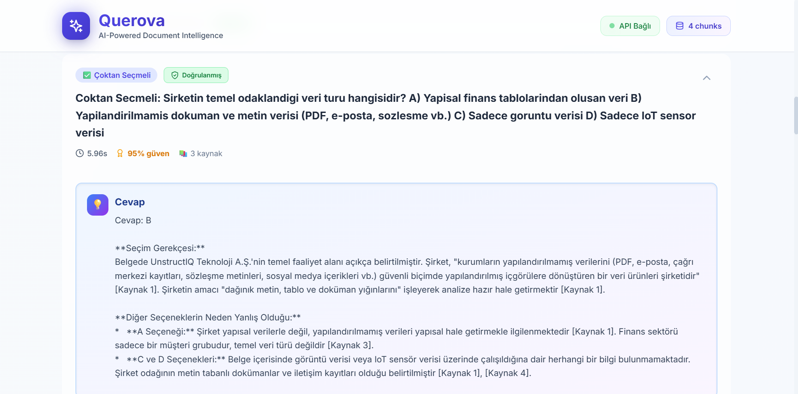
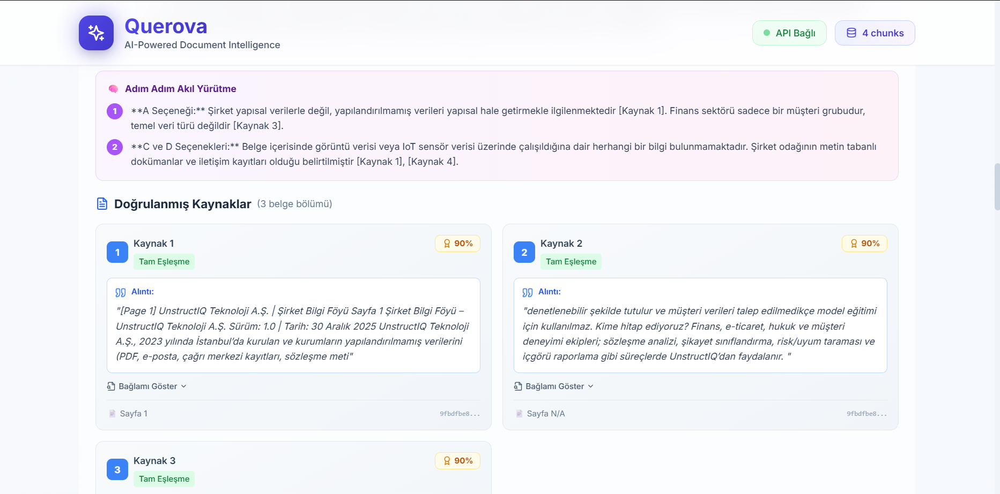

# 🚀 Querova - AI-Powered Document Intelligence

<div align="center">


**Belge analizi ve soru-cevap için yapay zeka destekli akıllı platform**

[](https://www.python.org/)
[](https://fastapi.tiangolo.com/)
[](https://reactjs.org/)
[](LICENSE)

[Demo](#demo) • [Özellikler](#özellikler) • [Kurulum](#kurulum) • [API Dokümantasyonu](#api-dokümantasyonu)

</div>

---

## 📖 İçindekiler

- [Genel Bakış](#genel-bakış)
- [Görüntüler](#Görüntüler)
- [Özellikler](#özellikler)
- [Teknoloji Stack](#teknoloji-stack)
- [Kurulum](#kurulum)
- [Kullanım](#kullanım)
- [API Dokümantasyonu](#api-dokümantasyonu)
- [Proje Yapısı](#proje-yapısı)
- [Katkıda Bulunma](#katkıda-bulunma)
- [Lisans](#lisans)

---

## 🎯 Genel Bakış

Querova, **Retrieval-Augmented Generation (RAG)** teknolojisi kullanarak belgelerinizi akıllıca analiz eden ve sorularınıza kaynak göstererek yanıt veren modern bir platformdur.

### 💡 Ne Yapar?

- **📄 Belge Yükleme**: PDF, DOCX, TXT formatlarında belgelerinizi yükleyin
- **❓ Akıllı Soru-Cevap**: 4 farklı soru tipiyle kapsamlı analiz
- **📚 Kaynak Doğrulama**: Her cevap için doğrulanmış kaynak referansları
- **🔍 Gelişmiş Arama**: Semantic search ile ilgili bilgileri bulun
- **🎨 Modern Arayüz**: Glassmorphism ve animasyonlarla estetik tasarım

## 📸 Görüntüler

### 📑 Arayüz


### 🪧 Sonuçlar


### 💡 Cevaplar


### 🔗 Kaynaklar


---

## ✨ Özellikler

### 🎯 Soru Tipleri

| Tip | Açıklama | Örnek |
|-----|----------|-------|
| 🔓 **Açık Uçlu** | Detaylı, uzun cevaplar | "Bu belge neyi anlatıyor?" |
| ✅ **Çoktan Seçmeli** | A, B, C, D seçenekleri | "Toplam chunk sayısı kaç? A) 120 B) 480 C) 860" |
| ⚖️ **Doğru/Yanlış** | Evet/Hayır sorular | "Pilot çalışmada 120 belge mi işlenmiş?" |
| 💬 **Kısa Cevap** | 1-2 cümlelik özet | "Kaç sayfa işlendi?" |

### 🔬 Kaynak Doğrulama

- **Exact Match**: Tam alıntı eşleşmeleri
- **Paraphrase**: Parafraz edilmiş içerik
- **Inference**: Çıkarım bazlı bilgiler
- **Confidence Scoring**: Her kaynak için güven skoru (0-100%)

### 🎨 Modern UI/UX

- ✨ Glassmorphism efektleri
- 🎭 Framer Motion animasyonları
- 🌊 Particle effects arka plan
- 📱 Responsive tasarım
- 🌈 Gradient temalar

---

## 🛠️ Teknoloji Stack

### Backend
```
🐍 Python 3.13.2
⚡ FastAPI 0.115.6
🗃️ ChromaDB 0.5.23 (Vector Database)
🤖 Google Gemini 2.0 Flash (LLM)
📄 PyMuPDF, python-docx (Document Processing)
🔍 Pydantic 2.10.5 (Data Validation)
```

### Frontend
```
⚛️ React 18.2
⚡ Vite 5.4
🎨 Tailwind CSS 3.3
🎭 Framer Motion 11.x
🔥 React Hot Toast
📤 React Dropzone
```

---

## 📦 Kurulum

### Gereksinimler

- Python 3.13+
- Node.js 18+
- Google Gemini API Key ([Buradan alın](https://ai.google.dev/))

### 1️⃣ Repository'yi Klonlayın
```bash
git clone https://github.com/yourusername/querova.git
cd querova
```

### 2️⃣ Backend Kurulumu
```bash
cd backend

# Virtual environment oluşturun
python -m venv venv

# Aktivasyon (Windows)
venv\Scripts\activate

# Aktivasyon (Linux/Mac)
source venv/bin/activate

# Bağımlılıkları yükleyin
pip install -r requirements.txt

# .env dosyası oluşturun
copy .env.example .env

# .env dosyasını düzenleyin ve API key ekleyin
notepad .env
```

**`.env` Dosyası:**
```env
GEMINI_API_KEY=your_api_key_here
GEMINI_MODEL=gemini-2.0-flash-exp
GEMINI_EMBEDDING_MODEL=models/text-embedding-004
CHUNK_SIZE=500
CHUNK_OVERLAP=50
MAX_FILE_SIZE=10485760
```

### 3️⃣ Frontend Kurulumu
```bash
cd ../frontend

# Bağımlılıkları yükleyin
npm install

# .env dosyası oluşturun
copy .env.example .env
```

**`.env` Dosyası:**
```env
VITE_API_URL=http://localhost:8000/api/v1
```

### 4️⃣ Çalıştırma

**Terminal 1 - Backend:**
```bash
cd backend
uvicorn app.main:app --reload
```

**Terminal 2 - Frontend:**
```bash
cd frontend
npm run dev
```

🎉 **Tarayıcınızda açın:** http://localhost:5173

---

## 🚀 Kullanım

### 1. Belge Yükleme

1. Ana sayfada **"Belgelerinizi Yükleyin"** alanına gidin
2. PDF, DOCX veya TXT dosyasını sürükle-bırak yapın
3. Yükleme tamamlandığında chunk sayısını görün

### 2. Soru Sorma

**Manuel Soru:**
```
Sorunuzu Yazın: "Bu belgedeki ana konular nelerdir?"
```

**JSON Yükleme:**
```json
{
  "questions": [
    {
      "id": "q1",
      "text": "Toplam kaç belge işlenmiş?"
    }
  ]
}
```

### 3. Sonuçları İnceleme

- ✅ Doğrulanmış kaynaklar
- 📊 Güven skorları
- 📄 Sayfa referansları
- 💡 Adım adım akıl yürütme

---

## 📚 API Dokümantasyonu

### 🔗 Base URL
```
http://localhost:8000/api/v1
```

### 📄 Documents

#### POST `/documents/upload`
Belge yükle
```bash
curl -X POST "http://localhost:8000/api/v1/documents/upload" \
  -H "Content-Type: multipart/form-data" \
  -F "file=@document.pdf"
```

#### GET `/documents/stats`
Belge istatistikleri
```bash
curl "http://localhost:8000/api/v1/documents/stats"
```

**Response:**
```json
{
  "total_chunks": 860,
  "total_documents": 120,
  "collection_name": "documents"
}
```

#### DELETE `/documents/{document_id}`
Belge sil
```bash
curl -X DELETE "http://localhost:8000/api/v1/documents/{document_id}"
```

### ❓ Questions

#### POST `/questions/single`
Tek soru sor
```bash
curl -X POST "http://localhost:8000/api/v1/questions/single?question=Bu%20belge%20neyi%20anlat%C4%B1yor"
```

**Response:**
```json
{
  "question_id": "...",
  "question_text": "Bu belge neyi anlatıyor?",
  "question_type": "open_ended",
  "answer": "...",
  "sources": [
    {
      "chunk_id": "...",
      "exact_quote": "...",
      "confidence_score": 0.92,
      "match_type": "exact"
    }
  ],
  "confidence_score": 0.85,
  "verification_status": "verified",
  "processing_time": 2.34
}
```

#### POST `/questions/upload-json`
JSON ile toplu soru
```bash
curl -X POST "http://localhost:8000/api/v1/questions/upload-json" \
  -F "file=@questions.json"
```

### 📖 Swagger Dokümantasyonu

Detaylı API dokümantasyonu:
```
http://localhost:8000/docs
```

---

## 📁 Proje Yapısı
```
querova/
├── backend/
│   ├── app/
│   │   ├── api/
│   │   │   └── routes/
│   │   │       ├── upload.py          # Belge yükleme
│   │   │       └── query.py           # Soru-cevap
│   │   ├── models/
│   │   │   ├── document.py            # Belge modelleri
│   │   │   └── question.py            # Soru modelleri
│   │   ├── services/
│   │   │   ├── document_processor.py  # PDF/DOCX işleme
│   │   │   ├── vector_store.py        # ChromaDB yönetimi
│   │   │   ├── gemini_service.py      # Gemini API
│   │   │   └── answer_processor.py    # Kaynak doğrulama
│   │   ├── config.py                  # Konfigürasyon
│   │   └── main.py                    # FastAPI app
│   ├── requirements.txt
│   └── .env
│
├── frontend/
│   ├── src/
│   │   ├── components/
│   │   │   ├── App.jsx
│   │   │   ├── DocumentUpload.jsx
│   │   │   ├── QuestionUpload.jsx
│   │   │   ├── ResultsView.jsx
│   │   │   ├── BackgroundEffects.jsx
│   │   │   └── GlassCard.jsx
│   │   ├── services/
│   │   │   └── api.js                 # API client
│   │   └── utils/
│   │       └── helpers.js
│   ├── package.json
│   └── .env
│
└── README.md
```

---

## 🤝 Katkıda Bulunma

Katkılarınızı bekliyoruz! 

1. Fork edin
2. Feature branch oluşturun (`git checkout -b feature/AmazingFeature`)
3. Commit edin (`git commit -m 'feat: Add amazing feature'`)
4. Push edin (`git push origin feature/AmazingFeature`)
5. Pull Request açın

### 📋 Geliştirme Önerileri

- [ ] Multi-language support (İngilizce, Almanca)
- [ ] Export to PDF/DOCX
- [ ] Conversation history
- [ ] User authentication
- [ ] Cloud deployment (AWS/Azure)
- [ ] Advanced analytics dashboard
- [ ] Real-time collaboration

---

## 📝 Lisans

Bu proje MIT lisansı altında lisanslanmıştır. Detaylar için [LICENSE](LICENSE) dosyasına bakın.

---

## 👨‍💻 Geliştirici

**Furkan Aksoy**

- 📧 Email: furkanaksoy@gmail.com
- 💼 LinkedIn: [Furkan Aksoy](https://www.linkedin.com/in/furkan-aksoy-07a256280/)
- 🐙 GitHub: [@FurkanAksoyy](https://github.com/FurkanAksoyy)

---

## 🙏 Teşekkürler

- [Google Gemini](https://ai.google.dev/) - LLM & Embeddings
- [ChromaDB](https://www.trychroma.com/) - Vector Database
- [FastAPI](https://fastapi.tiangolo.com/) - Backend Framework
- [React](https://reactjs.org/) - Frontend Framework
- [Tailwind CSS](https://tailwindcss.com/) - Styling
- [Framer Motion](https://www.framer.com/motion/) - Animations

---

<div align="center">

**⭐ Projeyi beğendiyseniz yıldız vermeyi unutmayın! ⭐**

Made with ❤️ by [Furkan Aksoy](https://github.com/FurkanAksoyy)

</div>